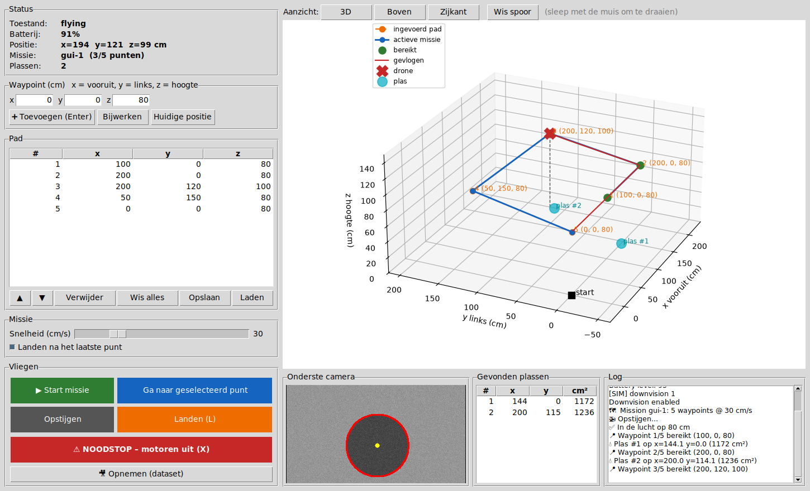
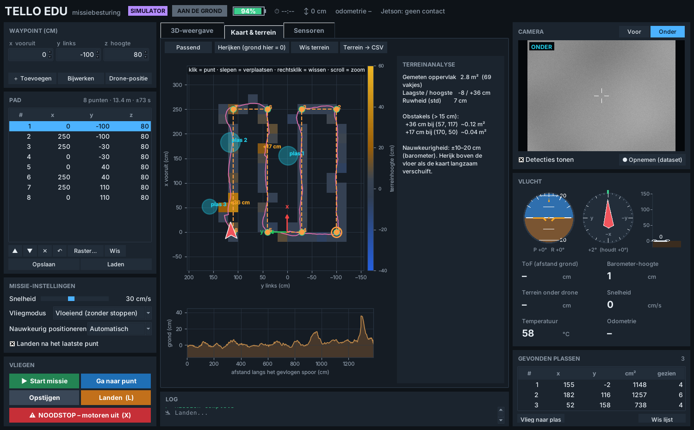
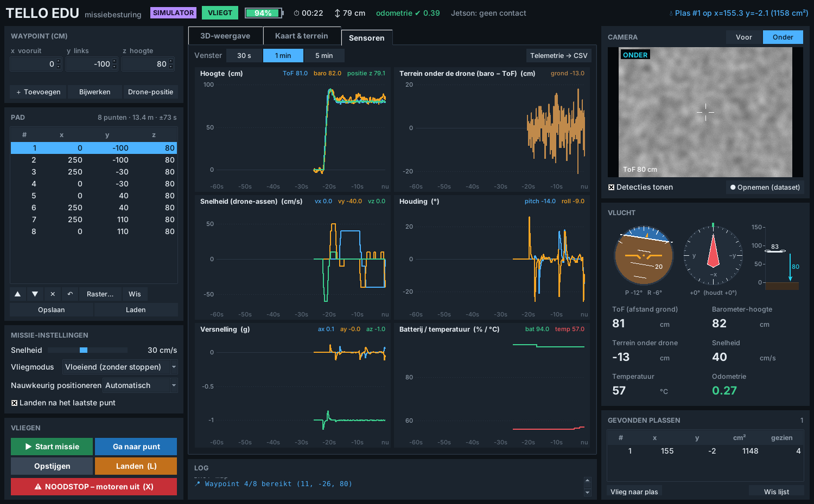

# Tello EDU – autonoom pad volgen + landen op een H

```
tello_gui.py          ← start hier: grafische besturing (pad plannen, 3D, terrein, sensoren, camera)
tello_combined.py     ← live vliegen met het toetsenbord (ZQSD), handig om te testen/kalibreren
drone/
    app.py            kern: missies afvliegen, landen op een H, Jetson-koppeling
    config.py         alle instellingen (netwerk, snelheid, geofence, camera, landen)
    navigator.py      positie + waypoints afvliegen (stap- of vloeiende modus)
    odometry.py       meet de echte beweging: camera (visuele odometrie), kompas, hoogte
    downcam.py        onderste camera: grijs + bijsnijden, pixel → coördinaat
    helipad.py        H-landingsplatform herkennen (zonder training)
    jetson_link.py    UDP/JSON-communicatie met de Jetson
    telemetry.py      alle sensorwaarden over tijd + terreinkaart (barometer − ToF)
    sim.py            simulator: alles testen zonder drone (`--sim`), met dozen op de vloer
gui/                  onderdelen van de GUI: thema, instrumenten, 3D-weergave, kaart
    keypress.py       toetsenbord-hulp voor tello_combined.py
json_flights/         opgeslagen vluchten (JSON), te openen met Opslaan/Laden in de GUI
docs/                 afbeeldingen voor deze README
```

## Opbouw

```
 Jetson  ──(UDP 9000: mission / abort / ...)──▶  Laptop  ──(Wi-Fi, djitellopy)──▶  Tello EDU
 Jetson  ◀──(UDP 9001: status / events ...)──  Laptop  ◀──(video onderste camera)──
```

De laptop hangt aan de Wi-Fi van de Tello. De Jetson moet de laptop via een **tweede netwerk**
kunnen bereiken (ethernetkabel of tweede Wi-Fi-adapter). Een alternatief: de Tello EDU in
*station mode* aan een router hangen (`ap <ssid> <wachtwoord>` sturen), dan zitten Tello,
laptop en Jetson op hetzelfde netwerk en maak je de drone aan met `Tello(host="<ip van de tello>")`.

## Coördinatenstelsel (“mission frame”)

Alles in **centimeter**:

* **x** = vooruit (richting van de neus van de drone, de kant van de voorcamera, bij de start)
* **y** = links
* **z** = hoogte boven de vloer
* **oorsprong** = waar de drone staat bij het opstijgen

De drone heeft zo zijn eigen assenstelsel. Bij **elke start vanaf de grond** wordt het opnieuw
gezet (`RESET_FRAME_ON_TAKEOFF`): de drone staat dan op (0, 0) en x wijst waar zijn neus naar
wijst, ook als je hem na een vlucht ergens anders of in een andere richting neerzet. Een pad
in een JSON-bestand vertrekt dus altijd vanaf de drone zelf. De knop **Reset omgeving** (na
een vlucht, op de grond) doet hetzelfde meteen en wist ook het spoor, de gevonden H, de
terreinkaart en de vorige missie in de GUI.

De Jetson rekent echte-wereldcoördinaten om naar dit stelsel. Staat de drone op wereldpositie `(X0, Y0)` (meter) met zijn neus in
richting `a` (graden), dan is voor een wereldpunt `(X, Y, Z)`:

```
x = 100 * ( (X-X0)*cos(a) + (Y-Y0)*sin(a) )
y = 100 * (-(X-X0)*sin(a) + (Y-Y0)*cos(a) )
z = 100 * Z
```

In plaats daarvan kan de Jetson ook vóór het opstijgen `{"type":"set_pose","x":..,"y":..,"yaw":..}`
sturen en dan rechtstreeks in zijn eigen stelsel (in cm) werken. Die positie blijft dan
gelden voor de eerstvolgende start (in plaats van het automatisch resetten).

## Installatie (in je venv)

```bash
pip install -r requirements.txt
```

## Gebruik

```bash
python tello_gui.py --sim             # eerst proberen zonder drone
python tello_gui.py                   # echte drone (laptop op de Wi-Fi van de Tello)
python tello_gui.py --record dataset  # meteen camerabeelden opslaan (dataset voor het model)
python tello_combined.py              # live vliegen met het toetsenbord
```



**Bovenbalk**: toestand, batterij, vliegtijd, hoogte, odometrie en of de Jetson berichten
stuurt. Meldingen (H gezien, waarschuwingen, fouten) verschijnen rechtsboven in plaats
van in pop-ups.

**Links: pad plannen en vliegen**
* **Waypoint**: vul x, y en z in (cm, pijltjes of scrollwiel = ±10) en druk op Enter of
  *Toevoegen*. Een waarde buiten de geofence kleurt meteen rood. Klik een punt in de lijst aan
  om het aan te passen (*Bijwerken*), te verplaatsen (▲▼) of te verwijderen (✕ of Delete).
  *Drone-positie* neemt de huidige positie over. **Ctrl+Z** maakt elke wijziging ongedaan.
* **Raster…** maakt een pad in banen (“grasmaaier”) over een rechthoek, om een gebied af te
  vliegen met de camera en het terrein in kaart te brengen. De tussenafstand wordt voorgesteld
  op basis van wat de camera op die hoogte ziet.
* Boven de lijst staan het aantal punten, de lengte en een schatting van de vliegduur.
* **Opslaan/Laden** (Ctrl+S / Ctrl+O): vluchten als JSON in `json_flights/`
  (zie `json_flights/mission_example.json` voor het formaat).
* **Vliegen**: *Start missie*, *Ga naar punt* (blijft daarna hangen), *Opstijgen*,
  *Landen* (toets L), *Landen op de H* (toets H), *Reset omgeving* (alleen op de grond, zie
  [Coördinatenstelsel](#coördinatenstelsel-mission-frame)) en **NOODSTOP** (toets X, motoren
  uit, de drone valt!).

**Midden: drie tabbladen** (Ctrl+1/2/3)
* **3D-weergave**: assenkruis bij de start (x rood = vooruit, y groen = links, z blauw = hoogte),
  oranje = gepland pad, blauw = actieve missie (ook van de Jetson), groen = bereikte punten,
  roze = gevlogen spoor, het drone-modelletje draait mee met de richting en kantelt met
  pitch/roll (rode rotors = voorkant), cyaan = de gevonden H en wat de camera nu ziet, gekleurde
  tegels = gemeten terrein. Slepen = draaien, scrollen = zoomen, of kies *3D*, *Boven*,
  *Zijkant* of *Achter*. De assen schuiven vloeiend mee in plaats van te verspringen.
* **Kaart & terrein**: bovenaanzicht met de terreinkaart. **Klik** om een punt toe te voegen
  (hoogte = het z-veld), **sleep** een punt om het te verplaatsen, **rechtsklik** om het te
  wissen, scroll om te zoomen. De gevonden H staat er als cyaan cirkel. Rechts de terreinanalyse,
  onderaan het hoogteprofiel langs het gevlogen spoor. Zie [Terreinanalyse](#terreinanalyse).
* **Sensoren**: live grafieken van hoogte (ToF, barometer, positie), terrein onder de drone,
  snelheid, houding (pitch/roll), versnelling, batterij en temperatuur. Kies het venster
  (30 s, 1 min, 5 min) en exporteer alles naar CSV voor een verslag.



**Rechts**: camerabeeld (voor/onder, met of zonder de H-detectie, opnemen voor de dataset),
de instrumenten (kunstmatige horizon, kompas met de vastgehouden richting, hoogtemeter met de
grond eronder), de belangrijkste sensorwaarden en waar de H gezien is.



De Jetson-verbinding blijft actief terwijl de GUI open is: missies van de Jetson worden
gewoon uitgevoerd en getekend.

## Protocol (JSON over UDP, één bericht per pakket)

**Jetson → drone** (poort 9000)

| type | velden | betekenis |
|---|---|---|
| `mission` | `id`, `waypoints` (`[{"x","y","z"}, …]` of `[[x,y,z], …]`), optioneel `speed` (10-100 cm/s), `land_at_end`, `nav_mode` (`"go"`/`"rc"`), `fine` (`"auto"`/`"all"`/`"last"`/`"off"`), `level`, `helipad_search` (zie [Landen op een H](#landen-op-een-h-helipad)) | Opstijgen (als nodig) en de waypoints afvliegen |
| `abort` | – | Missie afbreken na de huidige stap en landen |
| `land` / `takeoff` | – | `land` breekt ook een lopende missie af |
| `helipad_land` | – | Test zonder pad: opstijgen (als nodig), een H onder de drone zoeken en erop landen |
| `set_pose` | `x`, `y`, `yaw` (graden, links = positief) | Startpositie/-richting instellen (alleen op de grond) |
| `reset` | – | Omgeving resetten (alleen op de grond): drone = (0, 0), x = richting van de neus, gevonden H en terreinkaart wissen |
| `ping` | `t` | Antwoord: `pong` |

**Drone → Jetson** (poort 9001; naar het IP waar het laatste commando vandaan kwam, of `JETSON_HOST`)

| type | velden |
|---|---|
| `status` | `state`, `battery`, `pos {x,y,z,yaw}`, `odometry` (true/false), `mission`, `waypoint_index`, `helipad` (`{x, y}` of `null`) (elke seconde) |
| `ack` | `ref`, … |
| `waypoint_reached` | `id`, `index`, `pos` |
| `mission_done` / `mission_aborted` | `id`, `helipad` (waar de H gezien is, of `null`) |
| `error` | `ref`, `error` |

Objectdetectie (bv. plassen) zit niet in deze code: dat doet een getraind model, bv. op de
Jetson, op de beelden van de camera.

## Hoe het werkt

**Vliegen.** Zie [Nauwkeurig vliegen](#nauwkeurig-vliegen). Vóór het opstijgen worden alle
waypoints gecontroleerd tegen een geofence (`GEOFENCE` in `drone/config.py`).

**Pixel → coördinaat** (`drone/downcam.py`). Met de hoogte uit de ToF-sensor en de beeldhoek
van de camera wordt een pixel omgerekend naar cm. Daarna komt de positie van de drone op het
moment van het beeld erbij (min `FRAME_LATENCY_S` vertraging). Zo wordt de plek van een H
berekend.

## Terreinanalyse

De Tello heeft twee sensoren die samen het terrein kunnen meten:

* de **barometer** meet de luchtdruk, dus de hoogte van de drone t.o.v. de start;
* de **ToF-sensor** onder de drone meet de afstand tot wat eronder ligt.

`grondhoogte = barometer-hoogte − ToF-afstand`. Vliegt de drone over een doos, dan wordt de
ToF-afstand kleiner terwijl de barometer-hoogte gelijk blijft: daar ligt de grond hoger.
De eerste metingen in de lucht bepalen het nulniveau (de vloer bij de start).

De metingen worden per vakje van 20 × 20 cm gemiddeld (`TERRAIN_CELL_CM`). De analyse geeft het
gemeten oppervlak, de laagste/hoogste punten, de ruwheid en een lijst van **obstakels**
(aaneengesloten vakjes hoger dan `TERRAIN_OBSTACLE_CM` = 15 cm) en dalingen. Exporteren kan met
*Terrein → CSV*.

**Nauwkeurigheid**: de barometer ruist (±10–20 cm) en verloopt langzaam met de luchtdruk. Dozen,
treden en hellingen vind je dus wel, kleine hoogteverschillen niet. Verschuift de kaart in de
loop van een vlucht, hang dan boven de vloer en druk op *Herijken*. In `drone/config.py` kun je
met `TERRAIN_ALT_SOURCE = "h"` ook de eigen hoogteschatting van de Tello proberen in plaats van
de barometer.

Let op: boven een obstakel meet de ToF-sensor een kleinere hoogte. De odometrie gebruikt die
hoogte, dus net boven een rand kan ze even “kwijt” zijn (de drone vliegt dan verder in
stap-modus).

In de simulator liggen een doos (30 cm), een plank (12 cm) en een kist (45 cm) op de vloer
(`SIM_TERRAIN` in `drone/sim.py`), zodat je dit zonder drone kunt uitproberen.

## Nauwkeurig vliegen

De Tello heeft geen GPS. Vroeger werd de positie enkel *geschat* door alle commando's op te
tellen. Als de drone tussen twee punten stilhing en afdreef, of door wind draaide, wist de
code dat niet. Nu wordt de echte beweging gemeten (`drone/odometry.py`):

* **Visuele odometrie**: de onderste camera ziet de vloer. De verschuiving van de vloer
  tussen het beeld en een referentiebeeld, maal de grootte van een pixel op de grond (uit de
  hoogte en de beeldhoek), geeft de echte verplaatsing. Ook afdrijven tijdens het stilhangen
  wordt zo gemeten. Werkt het best op een vloer met wat textuur (tegels, hout, tapijt,
  vlekken). Op een egale, glanzende vloer of bij wazige beelden is de odometrie "kwijt" en
  wordt er gerekend met de commando's zoals vroeger. De GUI toont dat bij *Odometrie*.
* **Richting vasthouden**: het kompas (IMU) van de Tello meet de richting. Draait de drone
  weg van de startrichting, dan draait hij terug.
* **Hoogte** komt uit de afstandssensor onder de drone.

**Vliegmodi** (in de GUI bij *Vliegmodus*):

| Modus | Hoe | Voor |
|---|---|---|
| **Stap** (`go`) | Eén `go`-beweging per punt, berekend vanaf de *gemeten* positie. Afdrijven wordt dus bij de volgende beweging rechtgezet. | Betrouwbaar, werkt ook zonder odometrie. De drone stopt kort bij elk punt. |
| **Vloeiend** (`rc`) | De drone wordt 15× per seconde bijgestuurd langs het pad, zonder te stoppen. Wind wordt meteen gecompenseerd. | Vloeiend en nauwkeurig, maar heeft werkende odometrie nodig. Het eerste punt gaat in stap-modus (om de odometrie te controleren). Valt de odometrie weg, dan gaat hij verder in stap-modus. |

**Opstijgen en landen**: een Tello schuift bij het opstijgen en landen vaak 10–30 cm opzij,
ook zonder wind. Met werkende odometrie corrigeert het script dat nu:

* de odometrie blijft meten terwijl de drone stijgt of daalt (vroeger begon ze bij elke
  hoogteverandering opnieuw, waardoor het afschuiven tijdens het opstijgen niet gemeten werd);
* na het opstijgen gaat de drone terug boven de startplek (`TAKEOFF_RECENTER`);
* aan het einde van een missie daalt hij langzaam tot `LAND_HOVER_CM` (30 cm) terwijl hij boven
  het laatste punt blijft, pas daarna volgt de gewone `land` (`PRECISE_LAND`). De knop *Landen*
  en een noodlanding landen meteen, zonder deze stap.

In de simulator (met afschuiven bij opstijgen/landen) ging de afstand tussen start- en
landingsplek bij “1 m vooruit en terug” van 19–59 cm naar 6–25 cm. Werkt de odometrie niet
(GUI: *Odometrie ✖*), dan kan het script het afschuiven niet zien en dus ook niet corrigeren.

**Nauwkeurig positioneren**: de Tello kan geen `go`-beweging kleiner dan 20 cm maken. Met
kleine rc-bijsturingen zet de drone zich daarom tot op `FINE_TOL_CM` (10 cm) op het punt.
*Automatisch* doet dat alleen op het laatste punt: op elk punt bijsturen liet de drone bij
elk waypoint heen en weer schuiven.

**Minder bijsturen**: een paar cm naast het pad is niet erg, steeds bijsturen wel (elke
correctie buigt het pad). In de vloeiende modus vliegt de drone daarom evenwijdig aan het
pad zolang hij er minder dan `PATH_TOL_CM` (15 cm) naast zit; alleen wat daarboven zit wordt
bijgestuurd. Hij mikt ook verder vooruit op het pad (`RC_LOOKAHEAD_CM` 40 cm), wat rustiger
stuurt. De richting wordt pas gecorrigeerd vanaf `YAW_TOL_DEG` (6°).

### Landen op een H (helipad)

Ligt er een landingsplatform met een **H** in de buurt van het laatste waypoint, dan landt de
drone in het midden van de H (`HELIPAD_LAND`, `drone/helipad.py`):

1. Tijdens de vlucht en bij het eindpunt zoekt de onderste camera naar een H. Ziet hij er
   geen, dan stijgt hij boven het eindpunt naar `HELIPAD_SEARCH_HEIGHT_CM` (150 cm), waar de
   camera meer van de vloer ziet, en kijkt opnieuw.
2. Een H telt alleen binnen `HELIPAD_RADIUS_CM` (80 cm) van het laatste waypoint. Anders
   landt hij gewoon op de coördinaten.
3. De drone stuurt zich boven het midden van de H en daalt alleen als hij erboven gecentreerd
   is (`HELIPAD_CENTER_TOL_CM`, 6 cm). De H wordt in elk camerabeeld opnieuw gemeten, dus hij
   blijft corrigeren tijdens het dalen.
4. Op `HELIPAD_FINAL_CM` (40 cm), of zodra de H de helft van het beeld vult, volgt de gewone
   `land`.

De detectie werkt zonder training: een donkere H op licht papier of een lichte H op een donker
platform, in elke richting gedraaid, vierkant of hoger dan breed. Andere vormen (vlekken,
tegels, randen) worden niet als H gezien: in de simulator 0 valse meldingen op 350 beelden
van de vloer. Maak de H minstens 15–20 cm groot, in een **vet lettertype zonder schreven**
(Arial Black, of gewoon drie rechthoeken), met balken van minstens een zesde van de breedte,
en het papier wat groter dan de H. Dunne letters of letters met voetjes (Times) worden niet
herkend.

**Controleren of hij de H ziet**: de detectie draait ook op de grond. Zet de GUI aan met
*Onder* en *Detecties tonen*, neem de drone in je hand en houd hem 50–100 cm boven de H: een
gevonden H krijgt een groen kader en een kruis in het midden. In de lucht schrijft het log
`🛬 H gezien op (x, y)` als hij er een ziet. Testen op foto's (bv. opgenomen met *Opnemen*):

```bash
python -m drone.helipad foto_van_de_h.jpg
```

**Testen zonder pad**: de knop *Landen op de H* (sneltoets `H`) stijgt op als de drone nog op de
grond staat, zoekt een H binnen `HELIPAD_RADIUS_CM` van waar hij hangt en landt erop. Leg de H
dus op minder dan ongeveer 50 cm van de drone. Ziet hij geen H, dan landt hij gewoon ter plaatse.
De knop *Landen* breekt het af.

**Rondvliegen en landen op de gevonden H** (`json_flights/h_search_test.json`, of de vinkjes
*Zelfde hoogte houden* en *Landen op gevonden H* in de GUI):

* `"level": true`: de drone houdt de hoogte van na het opstijgen en past ze nooit aan voor de
  vloer (de ToF-afstand), ook niet bij grote verschillen.
* `"helipad_search": true`: elke keer dat de camera onderweg een H ziet, wordt de plek
  onthouden. Na het laatste punt vliegt de drone terug naar die plek (de mediaan van alle
  waarnemingen) en landt in het midden van de H. Is er tijdens de hele vlucht geen H gezien,
  dan vliegt hij terug naar het **eerste** punt en landt daar.

In de simulator (`--sim`) ligt een H op (10, −30). Een missie die op (0, 0) eindigt, landt erop,
net als *Landen op de H* vanaf de startplek.

**Resultaat in de simulator** (zelfde parcours, met wind en draaien):

| Modus | Gem. fout per waypoint | Max. fout | Duur |
|---|---|---|---|
| Vroeger (alleen commando's) | 37–48 cm | 48–85 cm | 22 s |
| Stap + odometrie + richting vasthouden | 7–16 cm | 11–24 cm | 29–43 s |
| Vloeiend (rc) + odometrie | 7–11 cm | 10–17 cm | 21–22 s |

In het echt hangt dit af van de vloer (textuur) en van een goede kalibratie van de camera
(zie [Kalibreren](#kalibreren-belangrijk-vóór-de-eerste-echte-vlucht)).

**Veiligheid**: na elke beweging wordt de gemeten verplaatsing vergeleken met het commando.
Is de gemeten beweging even lang maar 90°, 180° of 270° gedraaid, dan is het camerabeeld
gedraaid gemonteerd: dat wordt één keer automatisch gecorrigeerd (`CAM_ROTATE_DEG`). Klopt het
dan nog niet, dan wordt de odometrie uitgeschakeld en vliegt de drone verder zoals vroeger.

**Kleine hoogteverschillen**: de hoogte komt uit de ToF-sensor, die de afstand tot de grond
meet. Een kleine trede of plank in de vloer lijkt dus een hoogteverandering. Verschillen
kleiner dan `Z_DEADBAND_CM` (25 cm) worden niet gecorrigeerd: de drone vliegt gewoon recht
door. Zet het op 0 als je wilt dat hij de hoogte altijd bijstuurt. In de vloeiende modus stopt de drone
ook als hij verder van het punt raakt in plaats van dichter. Draait de richtingcorrectie de
verkeerde kant op, dan schakelt die zichzelf uit (zie `YAW_SIGN`).

## Beelden opnemen (dataset voor het model)

Objectdetectie gebeurt door een getraind model buiten deze code. Beelden om dat model te
trainen neem je zo op:

```bash
python tello_gui.py --record dataset
```

Dit slaat 2 beelden per seconde van de onderste camera op als PNG, al bijgesneden en in
grijswaarden. Opnemen kun je ook aan en uit zetten met de knop *Opnemen* in de GUI. Train op
beelden van **dezelfde camera, hoogte en vloer** als tijdens de missie: dat is belangrijker
dan het aantal beelden.

## Kalibreren (belangrijk vóór de eerste echte vlucht)

1. **Beeld controleren.** Start `tello_combined.py`, zet downvision aan (V) en maak een foto (F).
   Kijk of het onderste camerabeeld in zwarte randen zit. `AUTO_CROP` vangt dat normaal op;
   anders zet je `DOWNCAM_CROP = (x, y, w, h)`.
2. **Beeldhoek (`CAM_HFOV_DEG`).** Houd de drone op een bekende hoogte `h` (cm) boven een
   meetlat en lees af hoeveel cm `W` er horizontaal in beeld past:
   `CAM_HFOV_DEG = 2 * atan((W / 2) / h)` (in graden).
3. **Oriëntatie.** Leg een donker voorwerp **vóór** de drone en schuif de drone er langzaam
   naartoe. Komt het voorwerp van **boven** het beeld binnen? Dan `CAM_FORWARD_SIGN = 1`, anders `-1`.
   Doe hetzelfde naar links voor `CAM_LEFT_SIGN`.
   Komt het voorwerp van **opzij** binnen terwijl je vooruit schuift, dan is het beeld 90°
   gedraaid: zet `CAM_ROTATE_DEG` (0, 90, 180 of 270). Dat wordt ook automatisch gemeten bij de
   eerste beweging van een vlucht; de log toont dan *Camerabeeld is … gedraaid* met de waarde
   die je in `drone/config.py` moet zetten.
4. **Richting (`YAW_SIGN`).** Zet de drone aan, open de GUI en draai de drone met de hand naar
   **links**: de *Richting* in de status moet **stijgen**. Daalt hij, zet dan `YAW_SIGN = 1`.
5. **Odometrie.** Vlieg met de stap-modus een punt 1 m vooruit. Klopt de camera-oriëntatie
   (stap 3) niet, dan zie je in de log "odometrie UITGESCHAKELD". Klopt de afstand niet
   (bv. de positie zegt 80 cm terwijl hij 1 m vloog), dan staat `CAM_HFOV_DEG` (stap 2)
   verkeerd: de odometrie gebruikt dezelfde beeldhoek om pixels naar cm om te rekenen.

## Veiligheid

* Eerst testen met `--sim`, daarna met een kleine missie (`json_flights/mission_example.json`) in een lege ruimte.
* De missie wordt geweigerd als de batterij onder `MIN_BATTERY` zit of een waypoint buiten de geofence ligt.
* Bij een fout tijdens de missie landt de drone automatisch. Een ongeldig commando (waypoint
  buiten de geofence, `set_pose` in de lucht, verkeerde snelheid) wordt geweigerd met een
  `error`, zonder dat een hangende drone daarvoor landt.
* *Landen*, *Abort* en de noodstop wissen ook missies die nog in de wachtrij stonden: na
  *Landen* stijgt de drone niet vanzelf weer op voor een volgende missie.
* Camera wisselen (voor/onder) tijdens een vlucht gebeurt pas als de drone klaar is met de
  huidige opdracht, omdat maar één thread tegelijk met de Tello mag praten. Met de voorcamera
  aan staan de odometrie en de H-detectie uit.
* Zet `JETSON_HOST` op het IP van de Jetson als `LISTEN_HOST = "0.0.0.0"`: dan worden alleen
  commando's van de Jetson aangenomen.
* De drone heeft genoeg textuur op de vloer nodig om stabiel te hangen. Een spiegelende natte
  vloer kan de optische flow storen: test dat voorzichtig.
* Alleen de missiethread stuurt vliegcommando's naar de Tello (djitellopy is niet thread-safe).
